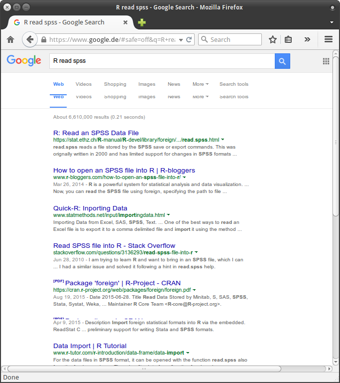

## Getting help

If you're starting with R you will encounter a lot of `Errors`, `Warnings`, `Messages` and other problems.
No one can do programming without errors. This chapter is how and where you can get help.

### R-help

#### Function documentation

R (and every package) comes with a comprehensive set of help files. Every function needs to have an accompanying help file.
Unfortunately, these help-files are not always easy to read.

You can access the help for every function by preceding it with a `?`:


```r
?mean
```
or by using the search field in the [help pane](../rintro/rstudio.html). This will open this file:


These help files always have the same structure (some parts can be missing):

* **Description:** A short description what the function does.

* **Usage:** Here you see all the function arguments.

* **Arguments:** A detailed description of the function arguments.

* **Details:** Usually, mathematical details about the implementation.

* **Value:** What does the function return?

* **Author(s):** Who wrote the function. If you have a question of find a bug you may contact the author.

* **References:** More information about the methods and how to cite them.

* **See Also:** Links to other related functions.

* **Examples:** This is perhaps the most useful part for a beginner. Here you find examples how the function is used. Copy them into the console and inspect the objects that are passed, what arguments are used and what the output is.

You can also run these examples directly from the terminal with the `?example()` function:


```r
example(mean)
```

```
## 
## mean> x <- c(0:10, 50)
## 
## mean> xm <- mean(x)
## 
## mean> c(xm, mean(x, trim = 0.10))
## [1] 8.75 5.50
```


#### Vignettes

Many package come with (high quality) tutorials/guides on the package.

You can list all available vignettes with 

```r
vigbette()
```

To open a specific vignette (here `intro-vegan` -  Introduction to ordination in vegan)


```r
vignette('intro-vegan')
```

You can also find them on every package page on CRAN ([e.g. for vegan](https://cran.r-project.org/web/packages/vegan/index.html)).


### Help on the internet
#### Google


When searching for a function you could first try to use a search engine. 
I always use `R` and a few keywords as query.

Here is the results when search for the question `How to read SPSS files into R`:


* The first hit brings us to a R-help file. The first line is `read.spss {foreign}` which tells us that the function name is `read.spss` and that it comes from the `foreign` package.

* The second hit is [R-bloggers](http://www.r-bloggers.com/), a popular blog aggregator about R. 
Follow this to get daily news and tutorials about R.

* The third hit goes to [Quick-R](http://www.statmethods.net/index1.html), the accompanying website to the book `R in action`.It offers also a lot of help to get started with R.

* The fourth hit is to StackOverflow (see below).


#### Question & Answer sites

Question & Answer sites, like [StackOverflow](http://stackoverflow.com/) are not only a valuable source of information (there are [more than 100,000 R-questions](http://stackoverflow.com/questions/tagged/r) on StackOverflow), you can also ask specific questions (and hopefully get a really good answer).
However, when asking a question on the internet you should invest some time and create a `reproducible example`.
This assists others diagnosing your problem and you get faster and better answers.

A good explanation how to make a reproducible example for R can be found [here](http://stackoverflow.com/questions/5963269/how-to-make-a-great-r-reproducible-example).


#### Mailing lists

There are also a lot of [Mailing lists](https://www.r-project.org/mail.html) for R.
Please read and follow the [posting guides](https://www.r-project.org/posting-guide.html) before sending anything to the list. `Reproducible examples` are always a good idea.

Moreover, there are several specific **S**pecial **I**nterest **G**roup (=: SIG) mailing lists.
For ecotoxicology the most useful (depending on your topic) ones are [`R-SIG-ecology`](https://stat.ethz.ch/mailman/listinfo/r-sig-ecology), [`R-SIG-phylo`](https://stat.ethz.ch/mailman/listinfo/r-sig-phylo), [`R-SIG-mixed-models`](https://stat.ethz.ch/mailman/listinfo/r-sig-mixed-models) and
[`R-SIG-Geo`](https://stat.ethz.ch/mailman/listinfo/r-sig-geo).


