## Basic Plotting

In this chapter we will explore the basic (but powerful) plotting capabilities of R. 
I later chapters I will also use the plotting system of [ggplot2](https://cran.r-project.org/web/packages/ggplot2/index.html). 
However, I refer readers to the [R Graphics Cookbook](http://www.cookbook-r.com/Graphs/) for an introdution to ggplot or the upcoming new edition of the [ggplot2-book](https://github.com/hadley/ggplot2-book).


### Plotting the distribution of a variable

First I generate 100 random data points from a N(5, 2) distribution.


```r
set.seed(123)
norm_vec <- rnorm(100, 5, 2)
```

One of the best method to plot distributions is a **histogram**:


```r
hist(norm_vec)
```

 

Note, that the number of bars is automatically computed by R.
However, we can change this and increase the number of bars to show more details:


```r
hist(norm_vec, breaks = 40)
```

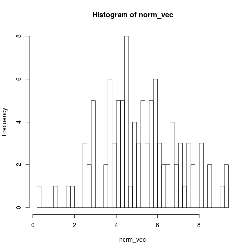 

or less bars, where we loose information.


```r
hist(norm_vec, breaks = 5)
```

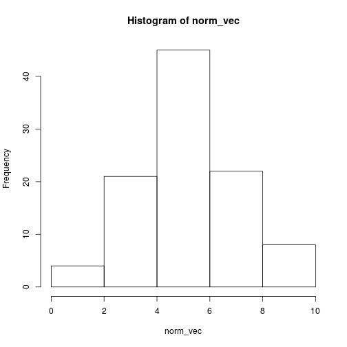 


Note, if we set `freq = FALSE` the area under the histogram is scaled to 1. 
This also allows us to draw a **density** line (this is like a smooth histogram) to the histogram.


```r
hist(norm_vec, freq = FALSE)
lines(density(norm_vec), col = 'darkblue', lwd = 2)
```

 

Note, that I used two additional arguments here:

* `col`, (=color) to specify the color of the line to darkblue (default = 'black') 
* ` lwd`, (=linewidth) to increase the thickness of the line (default = 1)

(Exercise: Change the colors of the bars of the histograms from above to a light gray.)


### Plotting two continuous variables

The basic plotting function in R is `plot()`.
This function can be used to create a lot of different plot types. 
In fact, most packages come with special types of plot for their specific functions (they are called '*methods*' of the plot function).

A basic plot is the scatterplot, mapping two continuous variables to the x and y-axis.

First I create a new simulated vector and put both into a data.frame:

```r
# same data as above
set.seed(123)
norm_vec <- rnorm(100, 5, 2)
# new vector
norm_vec_y <- 0.5 + norm_vec + rnorm(100)
df <- data.frame(norm_vec, norm_vec_y)
```

All code below will use this data.frame.
(Note, that the second vector is created in a speciel way - it simulates a regression model [---!!!link!!!---]).)

Next, we create a scatterplot:


```r
plot(norm_vec_y ~ norm_vec, data = df)
```

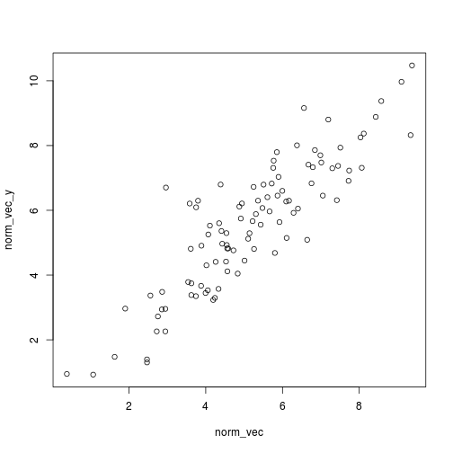 

Here I used a special notation to create this plot:

The `~` sign (called '*Tilde*') is used to specify which variable should be mapped on the y-axis (=before the tilde) and on the x-axis (=after the tilde).
The `data=` argument specifies the data.frame from where these variables should be taken (note that norm_vec_y and norm_vec are column names in this data.frame).

Later in this book, when dealing with models, we will frequently use this notation. 
For now you just need to know:
`variable on y-axis ~ variable on x-axis, data = data.frame`.

An alternative usage is:

```r
plot(x = df$norm_vec_y, y = df$norm_vec)
```

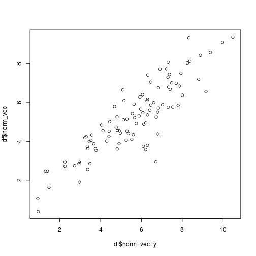 

Where is explicitly pass two vectors to the plot function.
I use here a new operator `$` to access the columns in a data.frame.
In the next chapter [---!!!link!!!---] we will learn more ways to access our data or parts of it.


### Customizing plots

R come also with a lot of possibilities to custimize the plot.

#### Shape of points
E.g. if we want to change the shape of the data points, we can use the `pch=` argument (=plotting character):


```r
plot(norm_vec_y ~ norm_vec, data = df,
     pch = 16)
```

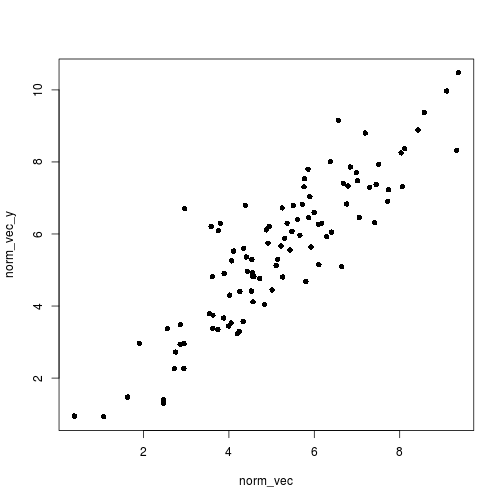 

Here I set pch to the integer value 16, which corresponds to filled circles, i tcan also be a character (e.g. `pch = 'H'`).
Please, read the help (and the examples therein) for `?pch` for more information.


#### Size of points

The size of points can be increased using the `cex=` argument (=character expansion factor).


```r
plot(norm_vec_y ~ norm_vec, data = df,
     pch = 16, cex = 2)
```

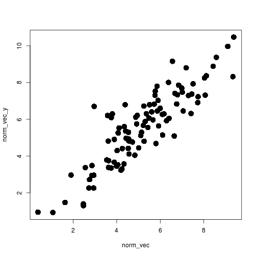 


#### Adding text to plot

Text can be added using the `text()` function. 
It can only add text, so you need to create a plot beforehand:


```r
plot(norm_vec_y ~ norm_vec, data = df,
     pch = 16, cex = 2)
text(x = 2, y = 14, labels = 'text top left')
```

 

The first two arguments specify the coordinates where the text should be placed. 
The third is the text to be placed.

By default the text is center-aligned around the coordinates. 
Often it is useful an easier to position if text is left aligned. 
This can be achieved with the `adj=` argument


```r
plot(norm_vec_y ~ norm_vec, data = df,
     pch = 16, cex = 2)
text(x = 2, y = 14, labels = 'text top left', adj = c(0, 0))
```

 

Here the text is placed right and top of the specified coordinates. 
`adj=` takes a vector of tow (horizontal and vertical alignment), play a little bit around with both values to get an impression how they are working.


#### Adding a straight line to a plot

Sometimes, you want to add a straight line to a plot, e.g. to indicate a treshold, a 1:1 line or a prediction from a linear regression model [---!!!LINK!!!---].
One way to is by using the `abline()` function


```r
plot(norm_vec_y ~ norm_vec, data = df)
abline(a = 0, b = 1)
```

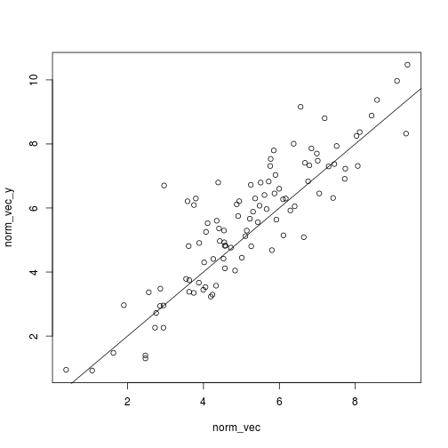 

Here I set the parameter `a` (=intercept of the line) to zero and `b` (slope of the line) to 1 - so this is the 1:1 line.

Vertical line can be added with the `v=` argument and `h=` for horizontal line respectively:


```r
plot(norm_vec_y ~ norm_vec, data = df)
abline(a = 0, b = 1)
abline(h = 6)
abline(v = 6)
```

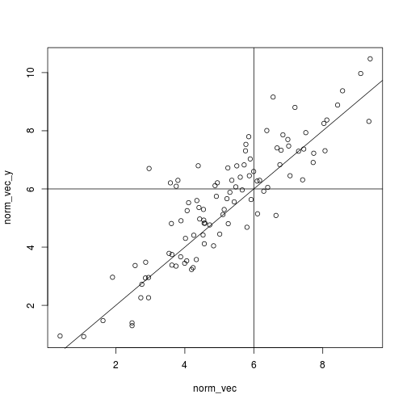 

You can change the appearance of the line using the `lwd=` (*=linewidth*) and `lty=` (*=linetype*) arguments:


```r
plot(norm_vec_y ~ norm_vec, data = df)
abline(a = 0, b = 1, lty = 'dashed', 
       lwd = 5, col = 'darkred')
```

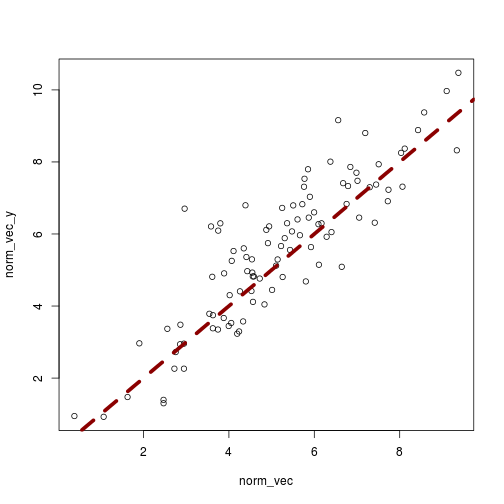 

`lty` can be either a character (e.g. 'solid', 'dashed', 'dotted') or a integer. 
Please read the enormouse help of `?par` for details and other possible arguments to change graphical settings.


#### Changing axis text

The axis labels and appearance is still no very nice. 
E.g. the names of the columns are displayed with the underscore.

These can be directly changed within the `plot()` function using the `xlab` and `ylab` arguments:


```r
plot(norm_vec_y ~ norm_vec, data = df,
     xlab = 'Normal Vector')
```

 

If we want to change the appearance of the axis, we initially supress the axis (using `xaxt='n'` or `xaxt='n'` or `axes = FALSE` for both) and then add an new axis to the plot:


```r
plot(norm_vec_y ~ norm_vec, data = df,
     xlab = 'Normal Vector', axes = FALSE)
axis(side = 1, at = c(2, 6, 9), labels = c('A', 'B', 'C'))
axis(side = 2, at = 1:10, labels = 1:10 / 100)
box()
```

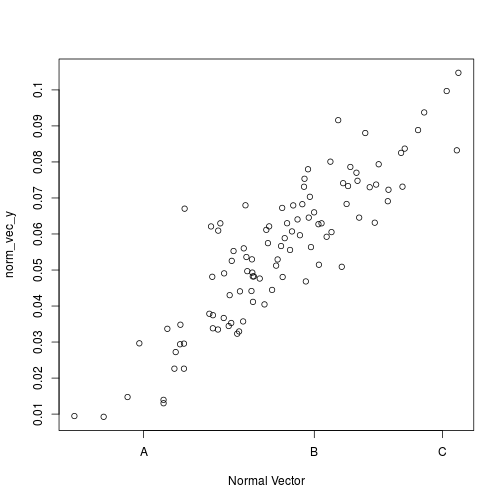 

The first call to `axis()` generates the x-axis (`side=1`) and adds letters at position 2, 6 and 9.
The second call adds the y-axis with the values divided by 100 (e.g. a conversion from cm to m).
The `box()` function simply draws a box around our plot.


### Plotting a continuous and a categorical variable

Often in ecotoxicology we are dealing with a factorial design and not with a regression design. 
A good way to display the results for e.g. different levels is the boxplot.

The `plot()` draws automatically a boxplot if the variable on the x-ais is a factor:


```r
# generate a new data.frame, with data from two normal distributions.
df_fac <- data.frame(y_num = c(rnorm(10), rnorm(10, 3)),
                     y_fac = rep(c('A', 'B'), each = 10))
```


```r
plot(y_num ~ y_fac, data = df_fac)
```

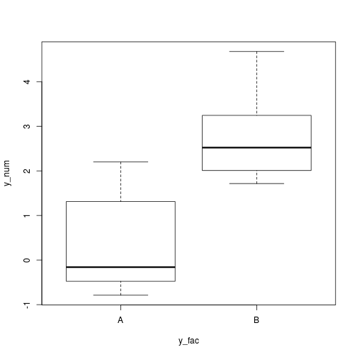 

Alternatively, you can use the `boxplot()` function.


