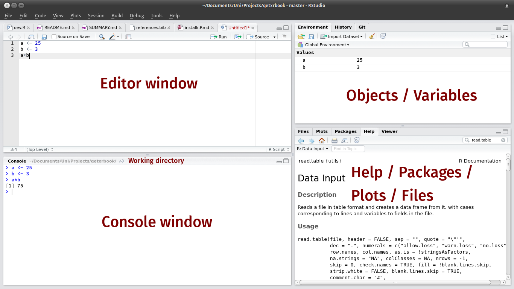

## Introduction to RStudio

### The interface
If you start RStudio you will see a window divided into four *panes*:

* **The Editor pane:** R programs (scripts) are a collection of functions. In the editor we simply write text files with the function calls we needed for the analysis. These scripts can be saved and rerun whenever needed (see also the chapter on [reproducible research](../misc/reproducible.html)). 
The commands type in the editor are not executed. To send the currently selected line to the *console* and execute it simply type `CTRL + ENTER`.

* **The Console pane:** Here you can directly type commands after the `>` and execute them by hitting `ENTER`. This is actually R. If you see an `+` instead, R expects more output to finish and execute the command. This is often the case when you have forgotten a closing bracket. Simply hit `ESC` to abort the command and return to `>`.

* **The Environment pane:** Here you can see which objects/value/data R know about. It's useful, because you can see the name and a summary of the objects. By clicking on them you can view the contents.

+ **The Help/Packages/Plot/Files pane:** Here are plots that you produce shown. Moreover, you can search within the help or browse through packages.

### Keys

One of the most powerful keys in RStudio is `TAB`. Try to hit the `TAB` key in many different situations.

RStudio will either

* auto-complete the word your spelling (looking up the objects that are currently availabe to R).
* show you a list of possible objects.
* show a shortcut of the help with possible arguments of a function.

